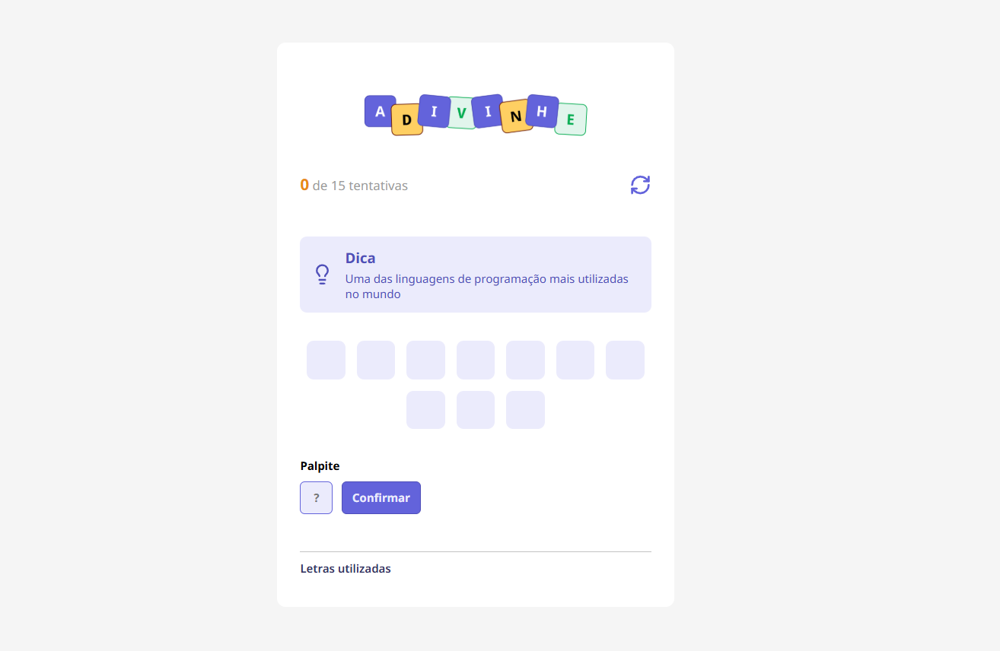

 

 

## 📖 Guessing Game

[🇧🇷 Leia esta documentação em Português](./README-pt-BR.md)

"Guessing Game" is an interactive word-guessing game built with React and TypeScript. The goal is to challenge the user to discover a secret word based on a thematic tip, testing their vocabulary and logical reasoning.

## 👩‍💻 What I Learned

In this project, I focused on mastering React fundamentals and creating interactive, dynamic interfaces. The key takeaways were:

--> 1. **Complex State Management:** Using the `useState` hook to control multiple synchronized states, such as score, used letters (`lettersUsed`), and the current challenge.

--> 2. **Lifecycle with useEffect:** Implementing side effects to monitor player progress. An effect is triggered upon every score update or attempt, automatically checking for victory or defeat conditions.

--> 3. **Game Logic and Array Manipulation:** Developing algorithms to select words randomly, filter repeated letters, and validate guesses using case-insensitive string comparison.

--> 4. **Component-Based Interface:** Creating modular and reusable components (`Letter`, `Input`, `Button`, `Tip`).

--> 5. **Static Typing with TypeScript:** Defining custom interfaces and types for data security, especially when handling complex objects like "Challenge" and "LettersUsedProps".

--> 6. **User Experience (UX):** Implementing dynamic visual feedback (changing letter colors), confirmation windows for restarting the game, and auto-focus on the input field.

## 💻 Project Structure

├── node_modules       # Dependencies

├── public             # Static public assets

├── src 

├── .gitignore

├── index.html

├── package-lock.json

├── package.json       # Dependencies and scripts (Vite/React)

├── README.md

├── README-pt-BR.md

├── tsconfig.app.json

├── tsconfig.json

├── tsconfig.node.json # TypeScript configurations

└── vite.config.ts 

## 💾 Prerequisites

--> Node.js

--> npm or yarn

## 🚀 How to Run the Project

-->  Clone the repository

--> Install dependencies

--> Start the development server

--> Run `npm run dev`

The server will start, and you can access the game at the configured port.

## ⚙️ Technologies Used

--> React

--> Vite

--> TypeScript

--> CSS Modules

--> ESLint

--> Git & GitHub